## Maven

> Maven是Apache下的项目管理工具，它由纯Java语言开发，可以帮助我们更方便的管理和构建。
> 软件生命周期  clean -> compile -> package -> install -> deploy ...
>
> - 依赖（jar）管理
> - 生命周期管理
> - 跨平台特性
> - 清晰的项目结构
> - 多工程开发，将模块拆分成若个工程，利于团队协作开发。
> - 一键构建项目：操作系统中无需安装eclipse和tomcat

### 一、安装和配置

#### 1.1安装和环境配置略。

#### 1.2Maven配置

### 二、Maven的jar包依赖

#### 2.1jar包管理

i. 从Maven中央仓库获取标准的的规范的jar包以及相关的依赖的jar包，避免自己下载到错误的jar包。

ii. 本地仓库统一管理jar包，是jar包与项目分离，减轻项目体积。


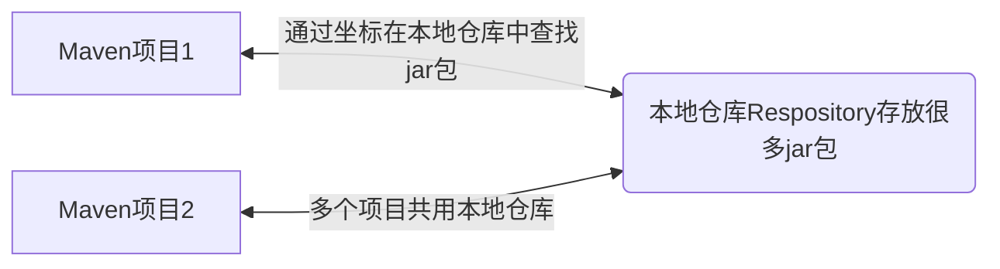

iii. Maven项目通过坐标的方式从本地仓库获取jar包：

1.坐标：由公司名/组织名（groupId）+项目名/子项目名（artifactId）+版本号（version）组成；
2.本地仓库：存放很多jar包，供Maven项目使用。
3.Maven通过建立本地索引，可以快速找到符合要求得jar包，从而解决效率问题。
4.多个Maven项目都可以从本地仓库获取jar包；
5.设置本地仓库：**maven根目录-->conf->settings.xml**,将localRespository标签中得路径替换成自己本地仓库的路径。

所以自己需要新建一个本地仓库。

#### 2.2设置本地仓库

> 把资料里面的respository拷贝到了Maven下，这个路径就作为本地仓库的路径。
> C:\Program Files\Maven\repository

它默认的本地仓库是C:\Users\18254\ .m\repository下，但是我的却没有这个文件夹，不过也没有关系，反正修改settings.xml后让本地仓库不是这个就行，当然我们也可以尝试解决这个问题。[方法](https://blog.csdn.net/qq_42479830/article/details/99686707?depth_1-utm_source=distribute.pc_relevant.none-task&utm_source=distribute.pc_relevant.none-task)

原始的settings.xml是这样的：
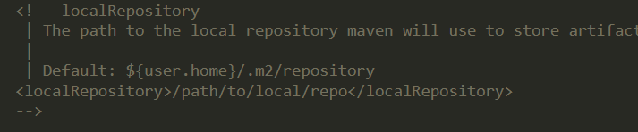

仓库修改到C:\Program Files\Maven\repository，修改settings.xml
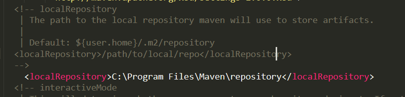

#### 2.3设置阿里云Maven仓库镜像

**i. Maven三种仓库概念：本地仓库、远程仓库、中央仓库**

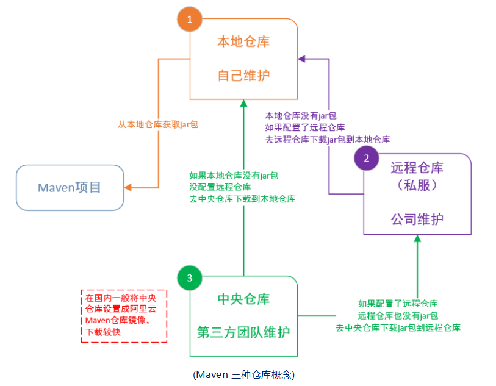

**ii.配置远程仓库（阿里云仓库镜像，可能jar包不是很全）**
在settings.xml文件中的mirrors下添加mirror标签。
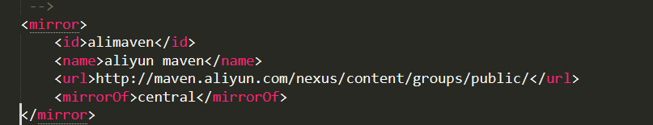
现在配置完了，当本地包不够的时候就去阿里云下载jar包了。这个找jar过的过程就像域名解析一样。

### 三、清晰的项目结构

### 四、使用Maven将大型项目按照模块拆分成若干工程

i. 大型商城项目按业务分成商品管理、用户管理、订单管理等等模块。

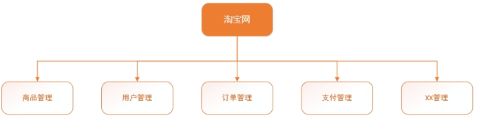

​                                                                            (大型项目，分模块开发)

 

ii. 中小型项目按照传统项目分为Web、Service、Dao层，依照员工自身的业务能力分配工作。

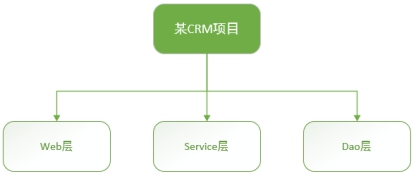


​                                                                         (中小型项目，分层开发)


### 五、利用命令行运行Maven项目文件

> 如果是一个普通的项目文件，那一定是先导入到eclipse中，然后再将其编译，再用tomcat打开。
>
> 但Maven项目不需要，直接一键运行就行，其实不是真的不需要，只是这些过程都是隐式调用了仓库中jar包了看不见而已。

#### 5.1一键运行

```
$ cd 项目目录
$ mvn tomcat:run
```

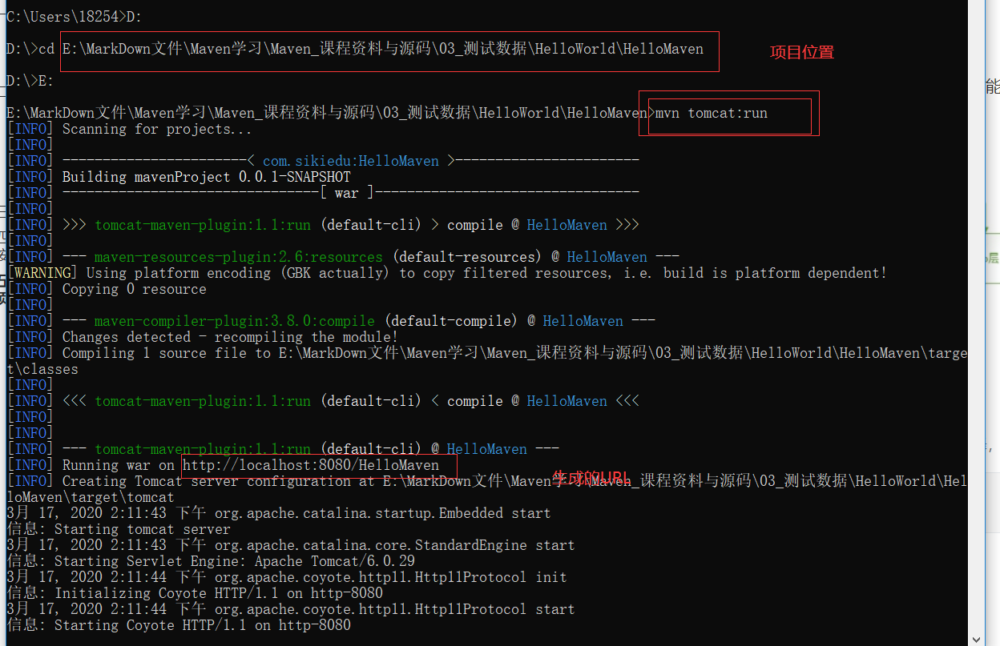

**会新产生一个target文件**

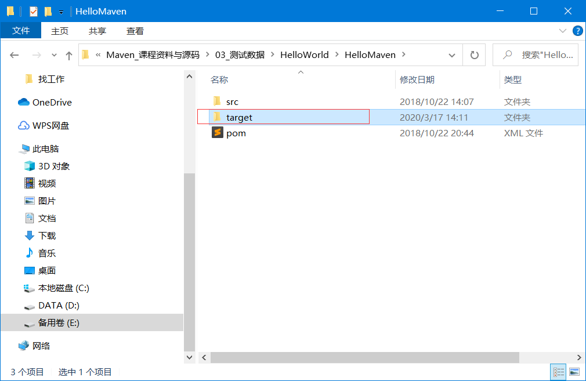

成功运行。弹幕里说人说他们有的失败了，估计是没联网，要么就没有设置好仓库jar包下的太慢了。

**问题：**
http://localhost:8080/HelloMaven
为啥我打不开呢，一开始是没有安装Tomcat以为打不开，可是安装以后还是打不开很奇怪。

**解决：**
有意思的是当我安装了tomcat并start后，上面的命令就不好用了，可能是因为占用了端口。
然后更有意思的是，我想一开始没打开是因为视频里要在URL后面加**/test**，我没看见，所以没打开，后来我下载安装了Tomcat并打开后，并且加上了test后还是不好使，这时候我想明白了，得关上刚下载的tomcat把8080端口让出来，再后来真就成功打开了。😋
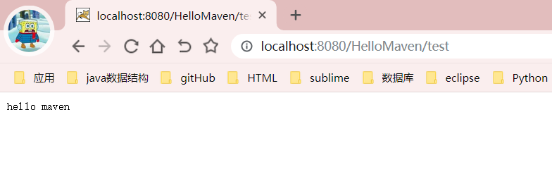

#### 5.2pom.xml

我们现在知道这个命令的运行是怎么运行的了，它需要jar包，可是这个jar包他是怎么找到的呢？
前面我们说过jar包的位置是通过坐标得到的，这个坐标写在哪里呢？

> **Maven文件下的pom.xml下**

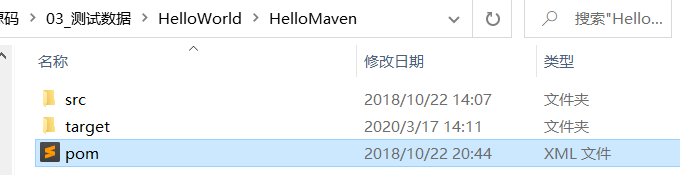

<dependencies><!-- 依赖标签 配置项目中依赖的jar包坐标 -->
	下面这三个依赖标签里面就是坐标信息，由公司名/组织名（groupId）+项目名/子项目名（artifactId）+版本号（version）组成，可以在本地的repository找到，如果本地没有，run命令的时候就能去阿里云下载/或者中央仓库。

```xml
<project xmlns="http://maven.apache.org/POM/4.0.0" xmlns:xsi="http://www.w3.org/2001/XMLSchema-instance" xsi:schemaLocation="http://maven.apache.org/POM/4.0.0 http://maven.apache.org/xsd/maven-4.0.0.xsd">
<!-- 上面这几行都一样-->
    
    <!-- 1.下面四行是项目的信息 -->
	<modelVersion>4.0.0</modelVersion><!-- maven版本 -->
	<groupId>com.sikiedu</groupId><!-- 域名反写 + 项目名 -->
	<artifactId>HelloMaven</artifactId><!-- 项目名 子项目名 模块名 -->
	<version>0.0.1-SNAPSHOT</version><!-- 版本号-类型 -->
	<packaging>war</packaging><!-- 打包类型 -->
	<name>mavenProject</name><!-- 当前项目名 -->
	<description>我的第一个maven工程</description><!-- 项目描述 -->
    
    <!-- 2.依赖的jar包 -->
	<dependencies><!-- 依赖标签 配置项目中依赖的jar包坐标 -->
	
		<dependency>
			<groupId>junit</groupId>
			<artifactId>junit</artifactId>
			<version>4.9</version>
			<scope>test</scope>
		</dependency>

		<dependency>
			<groupId>javax.servlet</groupId>
			<artifactId>servlet-api</artifactId>
			<version>2.5</version>
			<scope>provided</scope>
		</dependency>

		<dependency>
			<groupId>javax.servlet</groupId><!-- 公司组织的名称 -->
			<artifactId>jsp-api</artifactId><!-- 项目名 -->
			<version>2.0</version>			<!-- 版本号 -->
			<scope>provided</scope>
		</dependency>

	</dependencies>
	
    <!--3.项目运行环境的信息  -->
	<build>
		<plugins><!-- 插件列表 -->
			<plugin><!-- 通过坐标获取插件 -->
				<groupId>org.apache.maven.plugins</groupId>
				<artifactId>maven-compiler-plugin</artifactId>
				<version>3.8.0</version>
				<configuration>
					<source>1.8</source>
					<target>1.8</target>
					<encoding>UTF-8</encoding>
				</configuration>
			</plugin>
			
			<plugin>
				<artifactId>maven-project-info-reports-plugin</artifactId>
            <version>2.7</version>
        </plugin>
		</plugins>
	</build>
  
</project>
```
### 六、Manven常用命令

#### 6.1常用命令

**a) mvn clean：		清理编译后生成的目录，target文件就没有了；**注意clean的时候不要打开target中的文件

**b) mvn compile：	编译，只编译main目录，不编译test中的代码；**

**c) mvn test-compile：编译test目录中的代码；**

**d)mvn  test：		运行test里边的代码；**

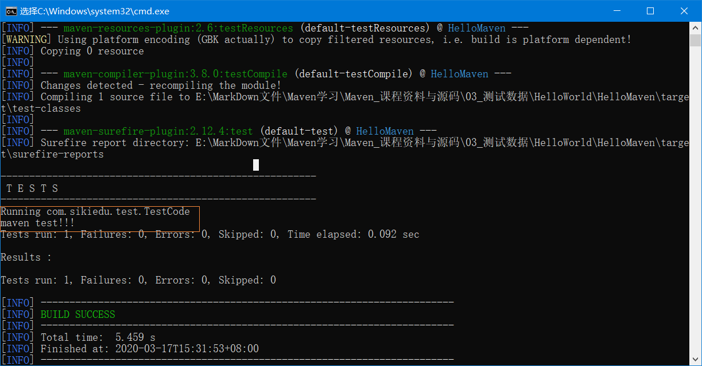

执行代码。test中有一个java文件中有sysout"maven test!!!"

**e) mvn package：	打包**

```xml
<packaging>war</packaging><!-- 打包类型 -->
```

打包类型在pom.xml中设置

i. java项目->打成jar包；

ii. web项目->打成war包；

**f)mvn install：发布项目到本地仓库，用在打jar包上，打成jar包可以被其他项目使用；**

上传到本地仓库后，会看见本地仓库有。注意本地仓库的属性得设置成可以写入才行，要不然会报错。

**g) mvn tomcat:run：一键构建项目；**

#### 6.2命令的生命周期和执行顺序

- 生命周期分为三种

  a) Clean	生命周期：mvn clean；

  b) Default	生命周期：mvn compile、mvn test-compile、mvn test、mvn package、mvn install

  c) Site		生命周期：site命令，生成项目描述文档静态页；

  讲一下site命令：

  ```
  $ mvn site
  ```

  运行后会在target文件夹下会找到一个site文件夹，里面有一些html的集合文档。

  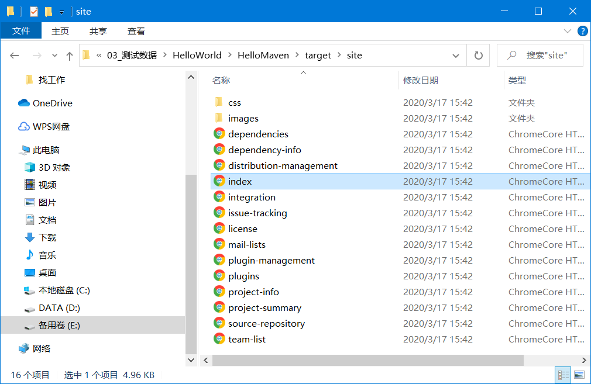
  打开index.html后，可以去看这个项目一些信息，比如依赖项啥的。
  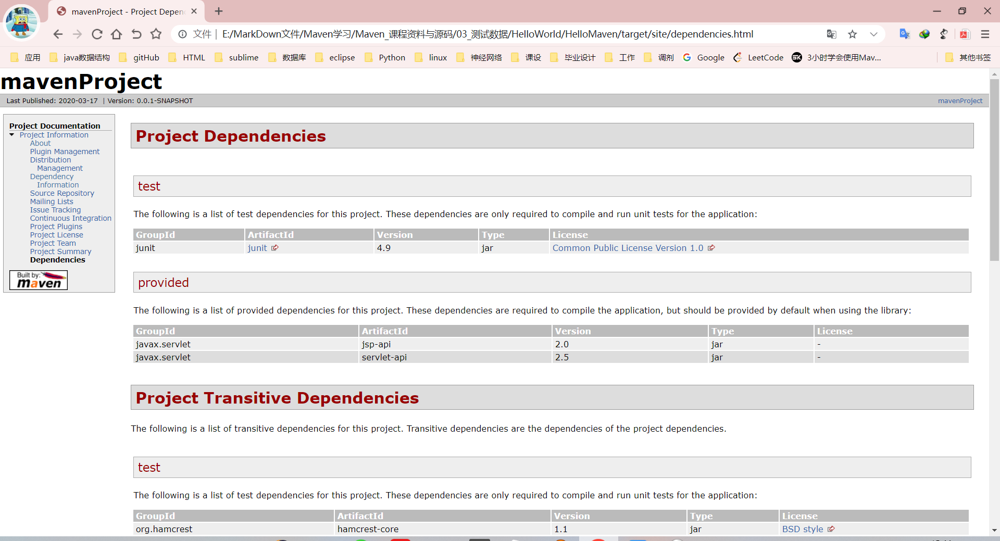

- 执行顺序

  ```
  $ mvn clean compile
  $mvn test-compile clean
  ```

  > 比如上面俩个例子，不同生命周期的命令可以同时执行。

  a) 在相同生命周期中的命令才会受执行顺序的影响；

  b) Default生命周期中的命令执行顺序：

  compile <- test-compile <- test <- package <- install；

  现在我执行下面的代码，进行测试。

  ```
  $ mvn clean  //先清除了target
  $ mvn install //打包发送到本地仓库
  ```

  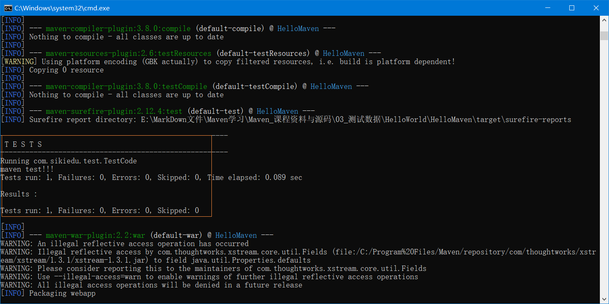

  先编译了那些Java文件。

  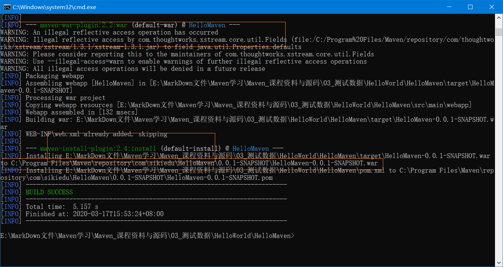

  打成war包，然后install到本地仓库，路径名是由pom.xml文件决定的。

  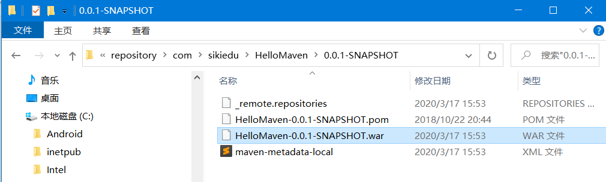

  ```xml
  <groupId>com.sikiedu</groupId><!-- 域名反写 + 项目名 -->
  <artifactId>HelloMaven</artifactId><!-- 项目名 子项目名 模块名 -->
  <version>0.0.1-SNAPSHOT</version><!-- 版本号-类型 -->
  ```

  **以上说明，install命令执行时前面的命令也都一起执行了，也比较好理解**
  
  

### 七、IDEA集成MAVEN插件

> 首先要确定本地已经安装了MAVEN环境

#### 7.1先配置一下IDEA中的setting设置

**1.IDEA中的setting配置要弄好**

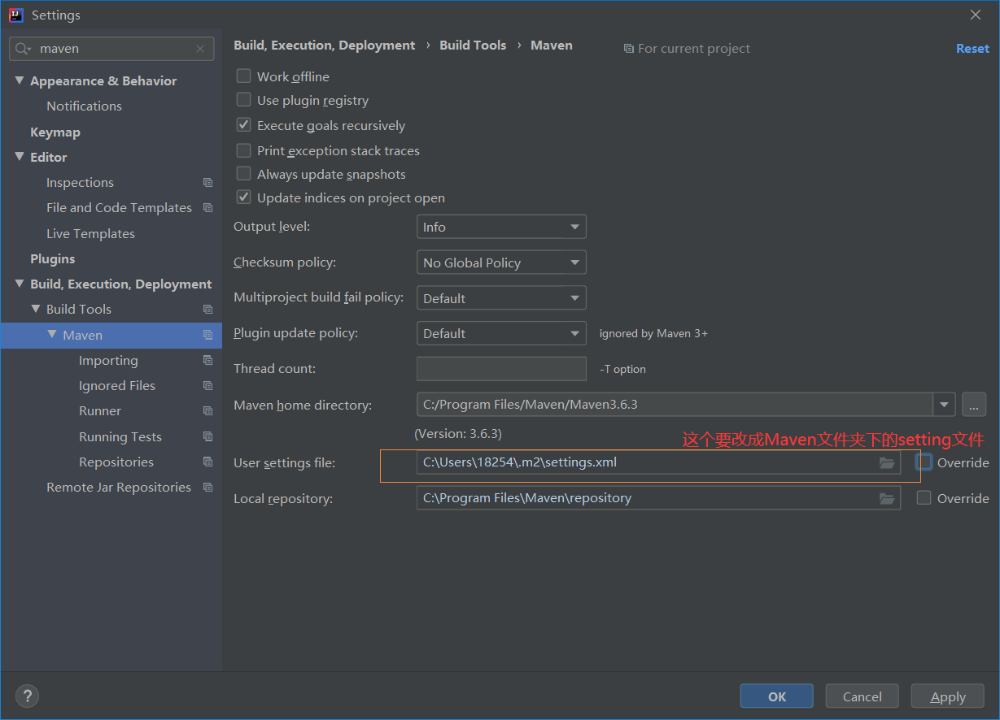

选择**本地Maven安装目录**，因为IDEA中还自带的会默认，然后一定要把默认的User setting files文件目录override改成C:\Program Files\Maven\Maven3.6.3\conf\setting.xml，前面讲过了。

**2.setting->Maven->Runner参数配置**

我们使用Maven为我们提供好的骨架来创建Maven工程的话，一般是需要联网的。使用这个参数-DarchetypeCatalog=internal，使得在不联网的情况下可以正常创建工程，当然是我们曾经联网下载过相关创建工程的插件，然后没网的时候就会直接从本地获取插件，以免没网的时候创建不了。

#### 7.2使用骨架创建maven的Java工程

**1.new project --> Maven --> Create from archetype选择骨架**

> 第一次使用需要联网获得这些骨架，如图所示

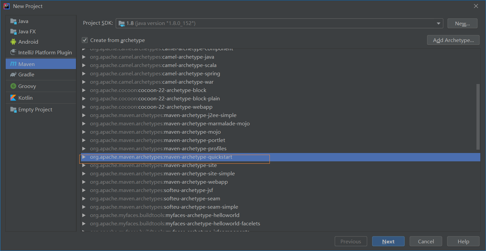

选择那个quickstart骨架，这个就是IDEA为Java工程提供的骨架，点击next。

**2.确定项目名字和项目坐标**

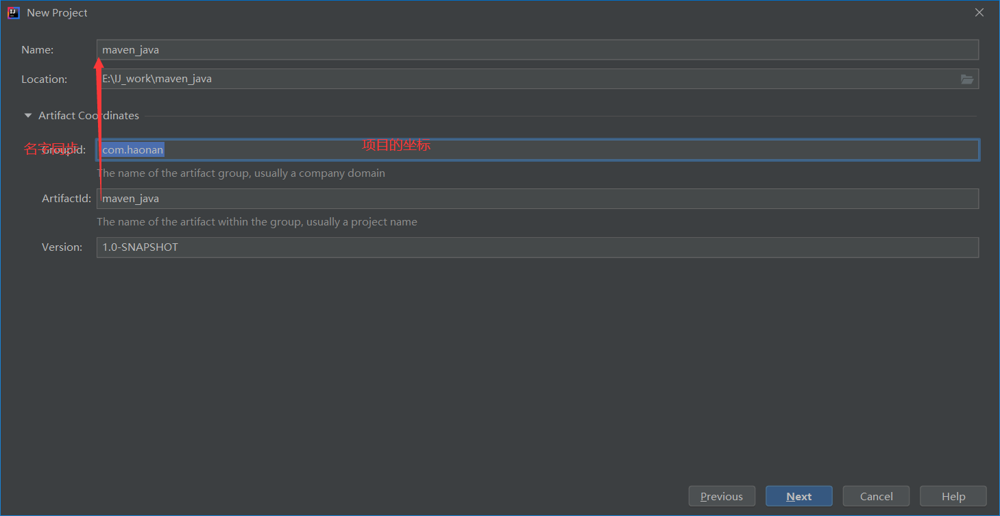

后面还会告诉让弄setting按照之前的来就行。
第一次创建项目后会很慢，因为要联网加载骨架到本地。

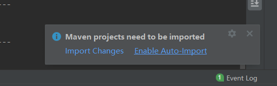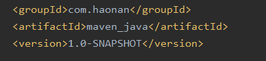
Enable允许自动导入。然后就完成了。并且把之前填写的公司啥的坐标填写到了pom.xml中。

**3.运行项目创建成功后自动生成的小demo——App.java**

> main test文件夹都有了，原来这些文件是自动生成的呀。之前还一直不明白呢，哈哈哈，有种茅塞顿开的感觉呢。

**4.补齐目录文件**

> 自动生成目录文件不全，需要补全

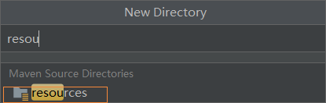
在main下面新建目录resources文件夹，如果不选择下面的提示，就要右键 Mark Directory as Resource Root作为资源根目录。


变成这样以后就可以往里面放配置文件了。

#### 7.3不使用骨架创建maven的Java项目

不选 Create from archetype骨架就行，这样创建起来很快。缺少一个可执行的demo而已（App.java）
目录结构到java那一层就结束了。

#### 7.4使用骨架创建maven的web工程

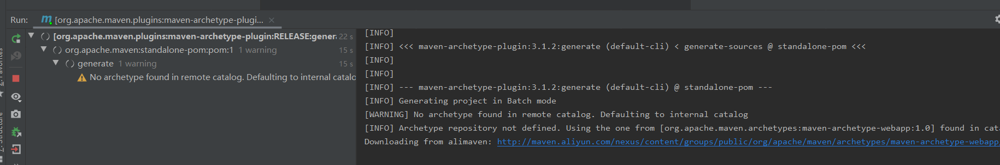

等着自动导入完成。

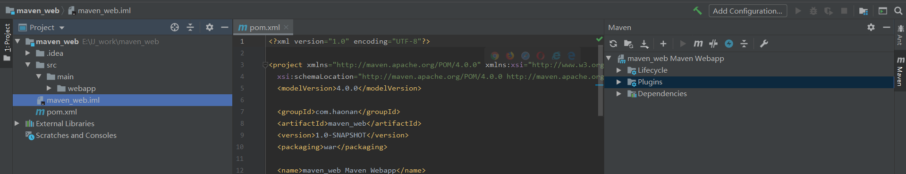

这样就ok了。但还是需要补齐一些文件。

- main下创建Java文件夹，并设置为Source Root  这个目录就用于写正式的代码

#### 7.5使用创建好的web文件写一个servlet实现jsp页面跳转

JSP页面需要创建在webapp下面。这里完全垮掉了，好像是因为社区版的IDEA不够强导致的。

### 八、Maven入门程序——Eclipse

> 先新建了一个专门用来学习Maven的workspace，放在了E:\eclipse_work\mavenLearning下，eclipse_work中其实还有项目，我实验过，打开eclipse_work的时候不会显示里面有这个mavenLearning东西，看来工作区就是工作区，挺好。

先到这里吧。2019-3-17
